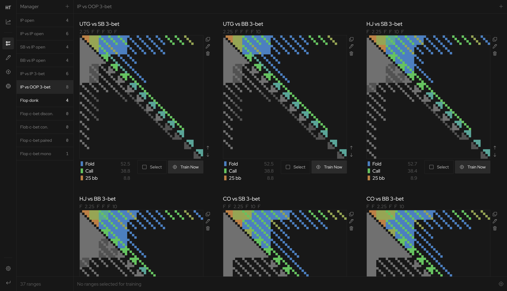
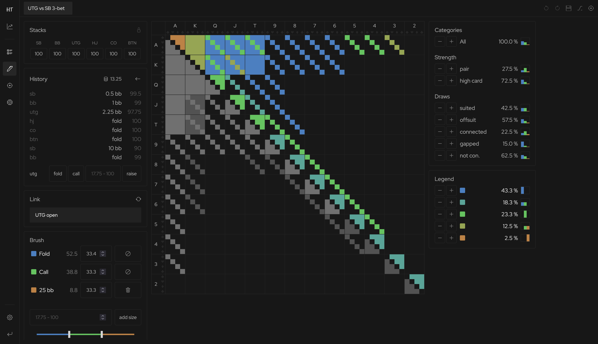
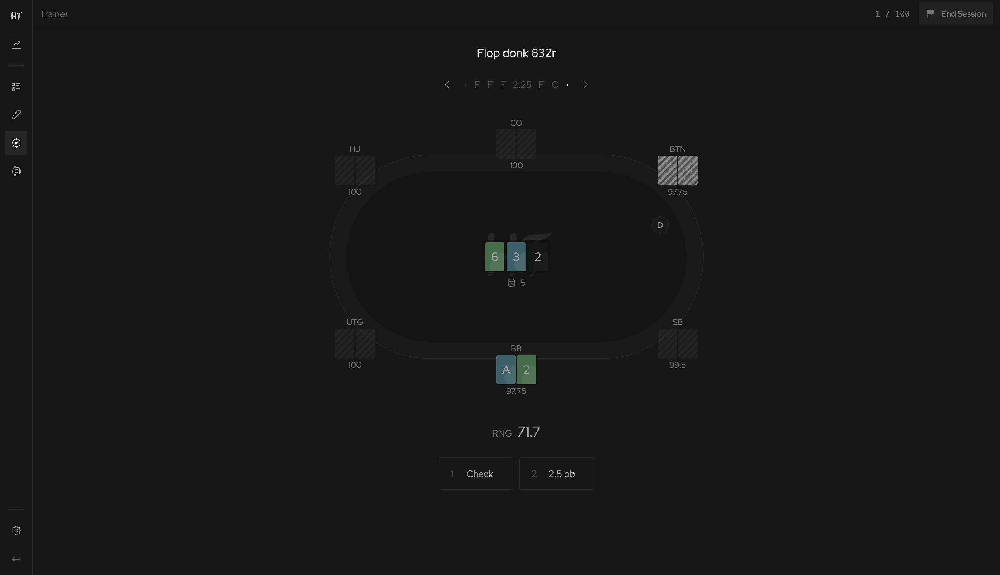

# Hold'em Trainer

## Manage your ranges and strategies

On Hold'em Trainer you can create ranges and strategies for any spot that is reachable with in a 6-max cash-game format (other formats will be supported soon). You can build an manage these ranges and strategies easily in the manager section of the application, after you've created a free account.

## Edit your strategies down to the last detail

A range in poker is the answer to the question: "What are the possible hands I or my opponent are likely to have in a particular scenario?".
A strategy for a given range answers the question: "What should I be doing with the different hands that I could be having in this scenario?".

Hold'em Trainer lets you create your ranges and strategies on the editor page.

- The __Stacks__, __History__, and __Link__ panels allow you to precisely define the scenario that has occurred in the hand. You can define the initial stack sizes, then the action history that has taken place including the board cards, and finally, you can link up this scenario to a previous action you've made during the hand that might have impacted the cards you are now holding.

    

- The __Matrix__ in the middle contains a grid of all possible two-card combinations you could be holding in your hand. The bottom-right cells tell you with what frequency you reach this particular spot with a particular hand and the top-right cells allow you to display the actions you would like to take.

- The __Brush__ tool in the bottom left allows you to define a strategy you would like to pursue with a given group of hands hand. This strategy may be a pure action, like folding, or raising to 10 big blinds, but it may also be a mixed strategy, which means taking different actions with different probabilities. If you think of a game like rock-paper-scissors you can quickly imagine why mixed strategies might play an important role in poker. To choose a certain strategy for a group of combos, select those combos in the matrix, define your strategy in the brush tool, and then click on the apply-brush button.

- The __Categories__ panel on the right-hand side breaks down the different hand combos present in your range into different hand strength categories. This is especially useful for postflop situations, where the hands are divided by strength, but also by the different flush- and straight draws that are possible.

- Finally, the __Legend__ panel gives you access to all your actively applied brushes. You can use this panel to quickly reselect all the combos that are using a particular brush, or simply to view those combos in isolation by hovering over the legend entry.

## Train them until they are second nature

Hold'em Trainer gives you the ability to practice all your strategies in an efficient manner. You can choose any number of strategies you'd like to practice, and the simulator will provide you with a clean and simple testing environment. This allows you to practice not only many more hands in a particular scenario than you could live, or even online, but also to get a more practical feeling for a strategy that you have only recently studies.

The trainer provides you with a random number generator, that will allow you to decide between the different actions if you have chosen a mixed strategy for a particular combo.

© 2025, Alon Landmann